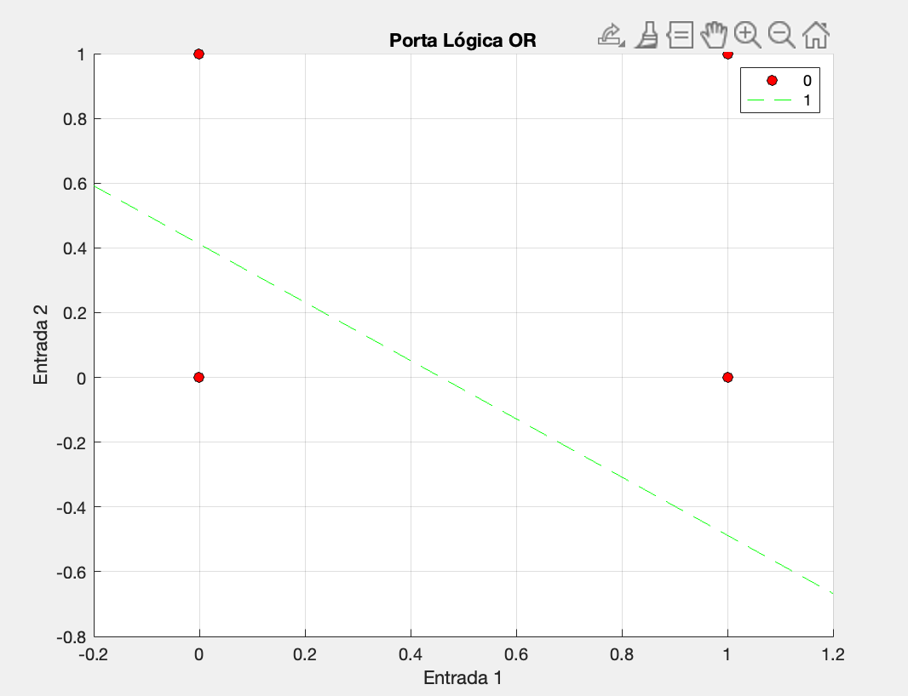

# Perceptron & MLP

 O projeto se trata de uma implementação simples de Redes Neurais Perceptron e MLP e foi criado no decorrer da disciplina de Inteligência Computacional do curso de Engenharia de Computação da Universidade Federal do Ceará (Campus Sobral).

 ## Execução
O projeto foi criado utilizando o **MATLAB R2023b**.
  - _O arquivo principal do projeto referente ao perceptron é o [perceptron.m](perceptron.m)._

## Requisitos

### Perceptron

Implementar rede neural Perceptron para a porta lógica **OU**.

 - [X] Usar valores aleatórios para os pesos iniciais do Perceptron
 - [X] O programa deverá exibir os pontos $(0,0), (0,1), (1,0)$ e $(1,1)$ bem como a reta formada após o treinamento `(6,0 pontos)`

### MLP

Classifique o conjunto de dados Vertebral Column Data set (disponível em
[https://archive.ics.uci.edu/ml/datasets/Vertebral+Column](https://archive.ics.uci.edu/ml/datasets/Vertebral+Column) em três classes `(normal, disk hernia e spondilolysthesis)` usando uma rede neural MLP. 

_É permitido usar funções prontas para o MLP._

- [ ] Utilizar a estratégia de validação hold-out (70% das amostras para treino e o restante para teste)
  - [ ] efetue 10  _execuções (permutar as amostras do conjunto de dados em cada execução)._ O resultado deve ser a acurácia média

A descrição completa do projeto e seus requisitos podem ser encontradas em [Descrição do Projeto.pdf](./Descric%CC%A7a%CC%83o%20do%20Projeto.pdf);

## Demo

### Perceptron

## Autores

|  |
|----------------------------------------------------------------------------------------|
| [Robson Mesquita Gomes](https://github.com/rob-ec)                                     |

